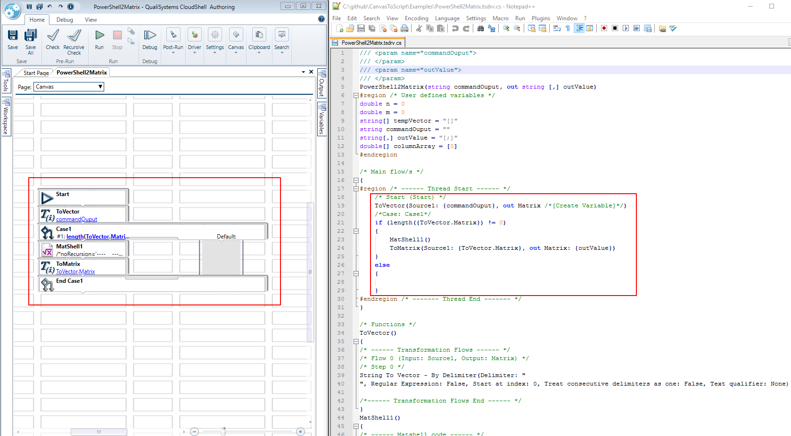

# CanvasToScript
This is a utility that generates a pseudo-script file from a CloudShell Authoring project/function or TestShell Test.

The script file will contain the most relevant information from a function/test and can be used for *comparison* (not merge) between two versions.

The answer to the next 2 common questions:
1. No, you can't execute this script file
2. No, there is no tool that creates the tsdrv/tstest from that script file
sorry..

You can find some example script files in the Examples folder. If you open it with notepad++, select the c# language, it will add the relevant style to it.

Using Notepad++ (or similar) make sure you set the language to c# - this will apply a relevant style to the script.

##### Side by side example:


##### How to use:

Run the CanvasToScript.exe file in a command line window to get the following options:
```
Usage:
-f filepath [this can be only a tstest file or a tsdrv file]
-p filepath [this can be only a tsdrvproj file]
-ff folderpath [this can be only a folder, just tstest and tsdrv files in that folder will be processed]
-fff folderpath [this can be only a folder, tsdrv and tstest files in that folder and sub-folders will be processed]
```
The script files will be generated in the same location of the source files, having the same name + a .script extension.
